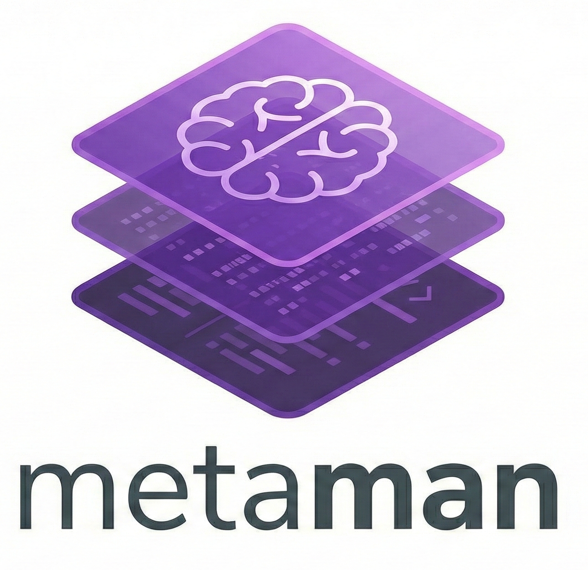
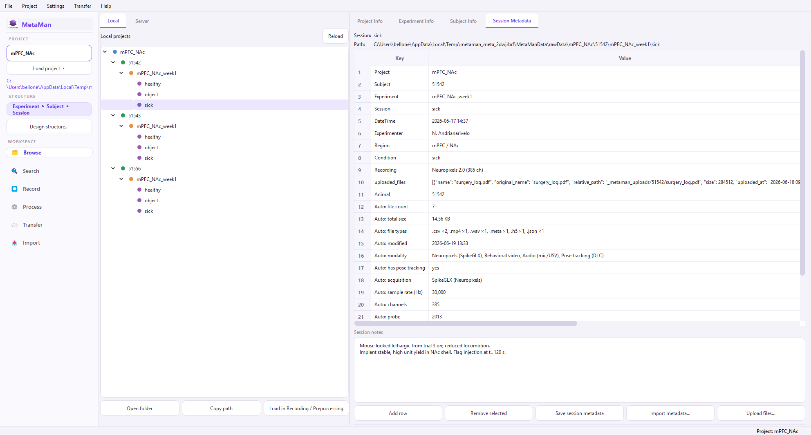
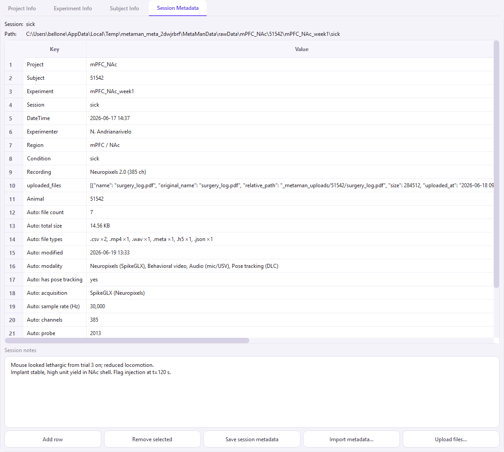
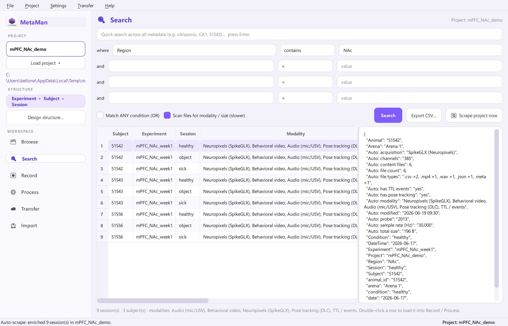
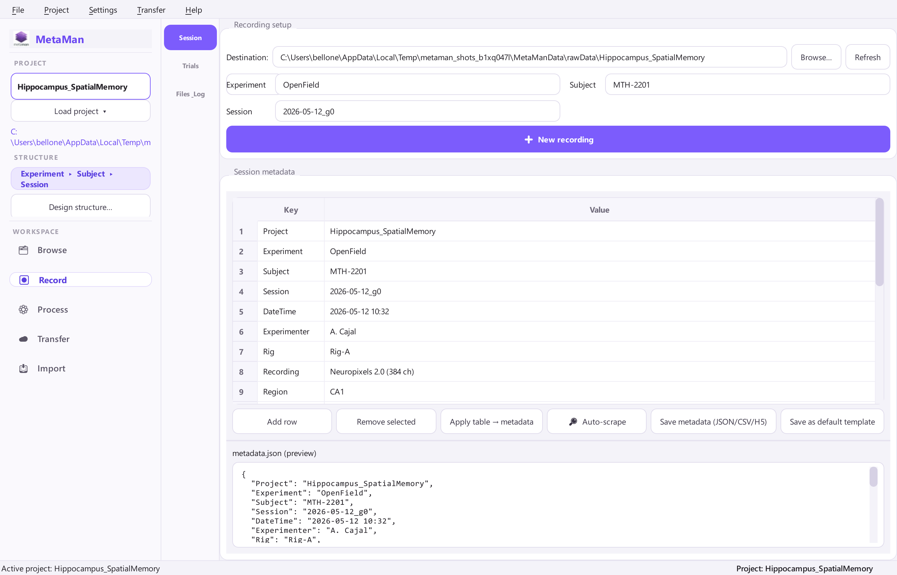
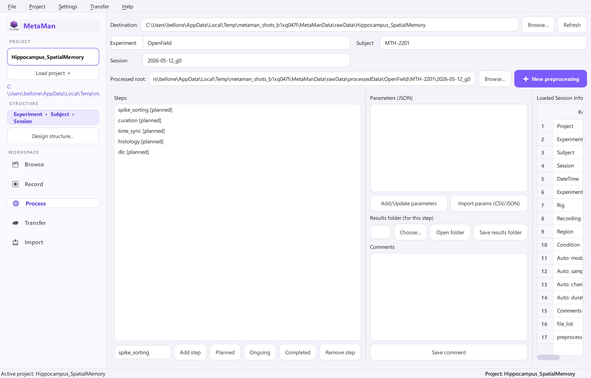
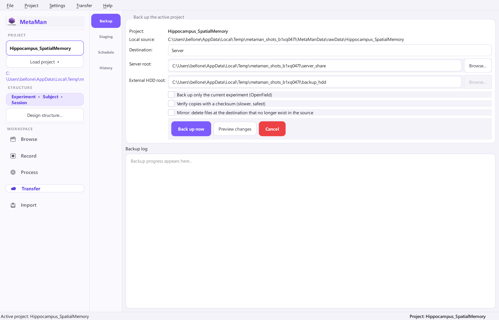
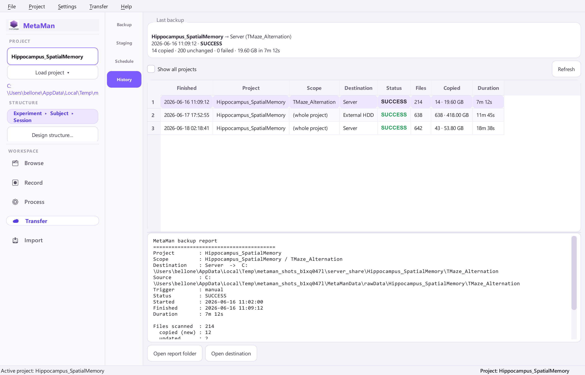
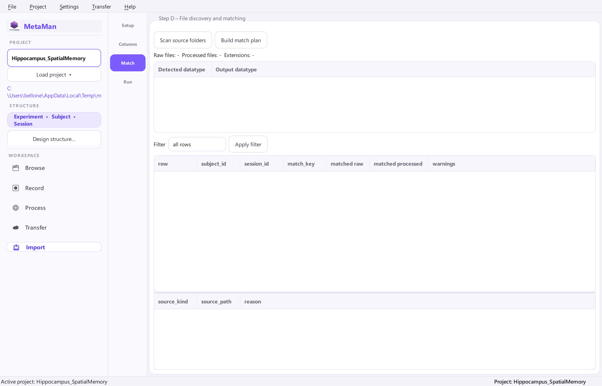
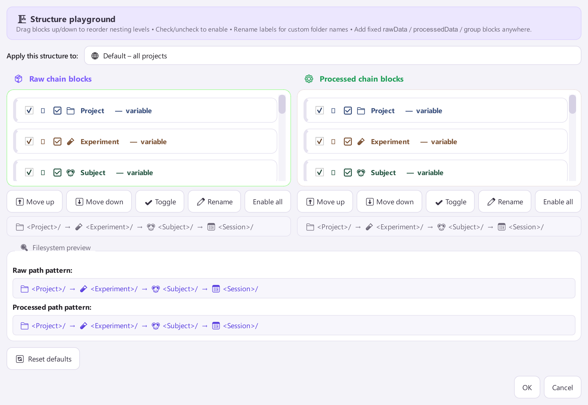

<div align="center">



# MetaMan

### 🧠 Neuro data organization without the folder chaos

*Browse it. Search it. Record it. Process it. Back it up. Reorganize it. Query it from Python. All in one calm, violet little workspace.*

[](https://www.python.org/)
[](https://doc.qt.io/qtforpython/)
[](#)
[](#-bonus-query-your-whole-lab-from-python)
[](#)
[](#-safe-by-default)

</div>

---

<p align="center">
  
</p>

<p align="center"><sub>The Browse workspace: one schema-driven tree for your whole lab, rich metadata on the right, live stats per node.</sub></p>

---

## ✨ Why MetaMan?

Neuroscience data is a hierarchy: **project → subject → experiment → session → files**. The problem is never the data, it is everything *around* it: folders that drift apart between rigs, metadata that lives in someone's head, backups nobody is sure ran, and that one heroic spreadsheet holding the lab together.

MetaMan turns that into a structure you can trust:

```text
data_root/
  rawData/        <project>/<subject>/<experiment>/<session>/...
  processedData/  <project>/<subject>/<experiment>/<session>/...
```

The hierarchy is **yours to design** (drag blocks around, see [Structure playground](#-design-your-own-hierarchy)), the metadata travels *with* the data as `json + csv + h5`, every copy is atomic and checksum-verifiable, and the whole project is one import away from a `pandas` DataFrame.

> ### 🆕 New in this release
> - 🔍 **Search workspace** - a first-class nav-rail tool to query and load any session in seconds.
> - 🐍 **Python analysis API** - `ProjectQuery` turns a project into a tidy DataFrame for Jupyter. [Jump to it ↓](#-bonus-query-your-whole-lab-from-python)
> - 🪄 **Metadata that scrapes itself** - open a project and MetaMan auto-detects modality, probe, sample rate, video and 384 kHz ultrasonic audio, in the background.
> - 📝 **Notes, metadata-from-file & uploads** - per-level notes, import metadata fields from CSV/TXT/JSON, and attach any file (surgery log, histology PDF...) to a project. [See it ↓](#-notes-metadata-from-file-and-file-uploads)

---

## 🧭 The six-stop workspace

MetaMan is a single window with a violet nav rail. Each stop is one job, and they all follow the **active project** you pick at the top.

| | Stop | What it does |
|---|---|---|
| 🗂️ | **Browse** | Walk the local + server trees, view/edit metadata at every level, right-click for dataset actions |
| 🔍 | **Search** | Query the project (16 operators), preview results, double-click to load, export to CSV |
| ⏺️ | **Record** | Create session metadata, auto-scrape acquisition files, write the `json/csv/h5` triplet |
| ⚙️ | **Process** | Track preprocessing steps, parameters and results folders per session |
| ☁️ | **Transfer** | Back up to server / external HDD, stage recordings, schedule daily jobs, read backup reports |
| 📥 | **Import** | Reorganize messy file dumps into the canonical structure from a metadata plan |

---

## 📸 Take the tour

### 🗂️ Browse: your whole lab as one tidy tree

Local and Server tabs share the same metadata panels. Colour-coded dots mark each level (project, subject, experiment, session), and selecting a node computes live stats (sessions, files, total size, modalities) off the UI thread so the window never freezes. Right-click any node to open, reveal, rename, delete (guarded), create children, or pull a server dataset down to a local copy.

<p align="center">
  
</p>

### 📝 Notes, metadata-from-file and file uploads

Every level (project, experiment, subject, session) has its own **notes** editor plus two power tools, right in the Browse panel:

- **Import metadata...** imports fields straight into the selected scope from `CSV` / `TSV` / `JSON`, or `TXT` (`key: value`, `key=value` or tab-separated pairs). Plain-text lines become notes. No more retyping the surgery spreadsheet by hand.
- **Upload files...** copies any file (a surgery log, a histology PDF, an analysis notebook) into `<project>/_metaman_uploads/...` and records it on the session under `uploaded_files`, so supporting documents travel with the data.

<p align="center">
  
</p>

### 🔍 Search: find any session in seconds

A free-text box plus stacked `field / operator / value` conditions (AND or ANY), powered by 16 operators (`= != contains regex > between in exists ...`). Tick **"scan files"** to query derived fields like `Auto: modality` or sample rate. The results table shows subject, experiment, session and modality at a glance; the detail pane shows the full metadata; double-click loads a session straight into Record / Process; one click exports the whole result set to CSV.

<p align="center">
  
</p>

### ⏺️ Record: metadata that writes itself (almost)

Point at a session, hit **Auto-scrape**, and MetaMan reads your acquisition files to fill in modality, sample rate, channel count, probe, video resolution, ultrasonic audio and the file list. Edit anything by hand, save the `json/csv/h5` triplet, and reuse a default template across sessions.

<p align="center">
  
</p>

### ⚙️ Process: a paper trail for every preprocessing step

Spike sorting, curation, time-sync, histology, DLC... track each step's status (planned / ongoing / completed), stash its parameters as JSON, import params from CSV/JSON, and attach a results folder under `processedData`.

<p align="center">
  
</p>

### ☁️ Transfer: backups you can actually prove happened

Back up the active project to a **Server**, an **External HDD**, or **Both**, with opt-in checksum verify and mirror/prune. Prefer to set it and forget it? Schedule a daily run. Every run is recorded with full metadata and a portable report.

<table>
<tr>
<td width="50%"></td>
<td width="50%"></td>
</tr>
<tr>
<td align="center"><sub>Backup: destinations, verify, mirror, dry-run preview</sub></td>
<td align="center"><sub>History: every run, status, throughput, full report</sub></td>
</tr>
</table>

### 📥 Import: turn a file dump into the canonical structure

Load a metadata plan (`csv/tsv/xlsx`), map your columns, scan multiple raw and processed source roots, and let deterministic key-matching pair files to sessions. **Dry run by default**, then execute the copy with overwrite-policy controls and a full match report.

<p align="center">
  
</p>

### 🧩 Design your own hierarchy

Not every lab nests folders the same way. The **Structure playground** is a drag-and-drop block editor: reorder levels, toggle them on/off, rename labels, and watch the live filesystem preview update. Save it as the default or per-project, and the schema travels with the data as a sidecar.

<p align="center">
  
</p>

---

## 🐍 Bonus: query your whole lab from Python

The Search workspace and the menu share **one Qt-free engine**, so the exact query you click in the GUI you can also run in a Jupyter notebook. It understands both metadata dialects (the canonical `metadata.json` and acquisition `*_metadata.json` files) and derives identity from the folder tree, so a stale `Subject: "rawData"` in a file can never lie to your analysis.

```python
from MetaMan.services.query import ProjectQuery

pq = ProjectQuery(r"B:/NPX/rawData/mPFC-NAc", scrape=True)

df = pq.to_dataframe()                 # one tidy row per session, ready for pandas
print(pq.summary())                    # subjects, modalities, date range, % preprocessed

usv = (pq.where("subject", "=", "51542")
         .where("Auto: audio kind", "contains", "ultrasonic")
         .where("date", "between", "2026-06-01..2026-06-30"))
usv.to_csv("nac_51542_usv.csv")
```

Track preprocessing across the whole project too:

```python
from MetaMan.services import preprocessing_ops as pp

pp.status_table(project_dir)                 # wide DataFrame: a column per step
pp.progress_summary(project_dir)             # % complete per step + overall
pp.pending_sessions(project_dir, "spike_sorting")
pp.bulk_set_status(project_dir, "curation", "completed", where=("subject", "=", "51542"))
```

Full guide: [docs/analysis_api.md](docs/analysis_api.md).

---

## 🪄 Metadata that scrapes itself

Open a project and MetaMan quietly enriches every session's metadata in the background (idempotent, so it is a no-op once everything is current). For each session it detects, without you lifting a finger:

- **Neuropixels / SpikeGLX**: sample rate, channel count, probe type and serial, NI-DAQ sync;
- **Behaviour**: video (resolution, fps, duration) and TTL / DLC tracking files;
- **Audio**: ultrasonic `.wav` microphones (it flags 384 kHz USV rigs);
- **Inventory**: file count, total size, file-type histogram, modified range.

Toggle it under **Settings ▸ Auto-scrape metadata on open**, or force a deep pass with **🔄 Scrape project now** in the Search tab.

---

## 🚀 Quick start

```bash
# 1. install dependencies
pip install -r requirements.txt

# 2. launch
python run_app.py
```

That is it. On first run MetaMan creates a safe local data root (`~/MetaManData`) with `rawData/` and `processedData/`. Point it anywhere you like from **File ▸ Set Data Root...**, design your structure, and start browsing.

---

## 🛡️ Safe by default

Moving terabytes off an acquisition machine is the scary part. MetaMan is built so an interrupted job never corrupts your data:

- **Atomic writes** - files land in a temporary `.mmpart` then get renamed, so a crash never leaves a truncated file at the real path.
- **Change-aware** - unchanged files are *skipped*; a same-name file whose source is newer/different is *updated* (size + mtime).
- **Verify (opt-in)** - re-reads each copy and compares a SHA-256 checksum.
- **Mirror / prune (opt-in, off by default)** - also deletes destination files that no longer exist in the source. Without it, backup is a purely additive copy.
- **Free-space precheck** - a backup that cannot fit is refused before it starts.
- **Cancel anytime** - long copies stop cleanly, and closing the app halts any in-flight job.
- **Preview changes** - a dry run shows exactly what a backup would copy / update / prune.
- **Structure sidecar** - `_metaman_structure.json` is written at the project root so a backed-up project carries its folder schema with it.

---

## 🔎 Feature deep-dive

<details>
<summary><b>🔍 Search workspace + query engine</b></summary>

- Quick free-text search plus up to four `field / operator / value` conditions, combined with **AND** or **ANY** (OR).
- 16 operators: `= != contains icontains startswith endswith regex > >= < <= in "not in" between exists missing`, all case-insensitive and date-aware.
- Optional **"scan files"** pass enriches results with `Auto:` fields so you can query modality, size and sample rate.
- Double-click a result to load it into Record / Process; **Export CSV** writes the full result table.
- Understands both metadata dialects and is schema-aware, so it finds sessions the old `metadata.json`-only search missed.
- Same engine is importable from Python (`MetaMan.services.query.ProjectQuery`).

</details>

<details>
<summary><b>🗂️ Navigation (Browse)</b></summary>

- Two tabs share one metadata view: **Local** (your data root) and **Server** (a network share). Both navigate the same project → subject → experiment → session hierarchy driven by each project's structure schema.
- On the **Server** tab, point at the share holding the projects and browse it exactly like the local tree (browsing the server never changes your active local project).
- View and edit metadata at all hierarchy levels, each with its own **notes** editor (saved with the metadata and to `session_notes.txt`).
- **Import metadata**: import fields into the selected scope from CSV / TSV / TXT / JSON (key/value rows or a one-row table); free-text lines are appended as notes.
- **Upload files**: copy arbitrary files into `<project>/_metaman_uploads/...`, recorded on the scope under `uploaded_files`.
- Load subject metadata from CSV for one or multiple subjects.
- **Right-click any node** for dataset actions: open, reveal, copy path, load a session into Record/Process, create a child, **Rename** and **Delete** (guarded: type-to-confirm, recycle bin where available).
- **Make local copy** (Server tab): right-click a server project / experiment / session and it is reconstructed under your canonical local `rawData/...` so you can pull data down for analysis.

</details>

<details>
<summary><b>⏺️ Recording &amp; 🪄 auto-scrape</b></summary>

- Create and update recording/session metadata; navigate the hierarchy via dropdowns.
- Auto-scrape acquisition files to infer modality, sample rate, channels, probe, video, ultrasonic audio and the file list.
- Background project-wide auto-scrape on project open (idempotent), toggleable in Settings.
- Update file list and metadata triplet outputs (`json/csv/h5`).

</details>

<details>
<summary><b>⚙️ Preprocessing</b></summary>

- Track preprocessing steps and completion status, store step parameters and comments.
- Import parameters from CSV/JSON; attach per-step results folders.
- Drive it project-wide from Python with `MetaMan.services.preprocessing_ops` (status tables, progress, bulk operations).

</details>

<details>
<summary><b>📥 Data reorganizer (Import)</b></summary>

- Load metadata plans (`csv/tsv/xlsx`); map columns (`subject_id`, `session_id`, `trial_id`, custom fields).
- Match files using deterministic keys; scan **multiple raw and processed source roots**.
- Dry run by default; execute copy with overwrite-policy controls.
- Generate match report, run log, and session/subject metadata outputs (`experiment_plan_normalized.csv`, `match_report.csv`, `run_log.txt`, `*_metadata.csv/.h5`).

</details>

<details>
<summary><b>☁️ Backup, schedule, history &amp; reports</b></summary>

- Manual backup to **Server**, **External HDD**, or **Both**; scheduled daily backups per project with optional experiment-level selection.
- Every backup run is recorded with full metadata: timestamp, scope, destination, duration, files copied / updated / skipped / failed / verified / pruned, bytes copied and average throughput.
- A **Last backup** card summarises the active project's most recent run.
- A report (`report_<ts>.json` + readable `.txt`, plus `history.csv`) is written to `<destination>/_metaman_backup/<project>/` so the record travels with the data.

</details>

<details>
<summary><b>🔗 Staging (linked recordings)</b></summary>

- Record new sessions **locally** without downloading server projects.
- Browse the server root to pick the target project, experiment and subject.
- Create linked recordings in a local staging area; each carries metadata tagging its server destination.
- **Sync all pending** or selected recordings with one click; staged recordings are also auto-synced during scheduled backups.

</details>

> Operational notes: actions and errors are logged to `~/.metaman/metaman.log`; settings are saved atomically. NWB / BIDS export is **not** included yet (it needs a dedicated data-mapping design and the `pynwb` dependency).

---

## 🎯 Design principles

- **Safe by default**: dry run + no blind overwrite.
- **Transparent operations**: logs, preview tables, match reports.
- **Responsive UI**: background worker threads for long operations.
- **Folder is truth**: identity comes from the folder tree, so stale metadata can never mislead a query.

---

## 🗃️ Project layout

```text
MetaMan/
  main.py            # window, menus, backup + auto-scrape orchestration
  state.py           # settings + active-project state
  io_ops.py          # metadata triplet read/write
  theme.py           # the violet workspace stylesheet
  nav_rail.py        # left navigation rail
  structure_designer.py
  tabs/
    navigation_tab.py
    search_tab.py            # 🔍 the Search workspace
    recording_tab.py
    preprocessing_tab.py
    transfer_tab.py
    data_reorganizer_tab.py
    staging_tab.py
  services/
    query.py                 # 🐍 ProjectQuery: dual-dialect, schema-aware query engine
    preprocessing_ops.py     # project-wide preprocessing status/progress/bulk ops
    scrape_ops.py            # idempotent project-wide auto-scrape
    metadata_scraper.py      # per-session SpikeGLX / video / audio / TTL detection
    session_assets.py        # notes, metadata-from-file import, file uploads
    search_service.py
    structure_schema.py
    server_sync.py
    backup_report.py
    staging_service.py
docs/
  analysis_api.md            # the Python query + preprocessing guide
```

---

## 💡 Tips

- Keep one canonical `data_root` with `rawData/` and `processedData/` subfolders.
- Use the Import dry run first, then execute.
- Let auto-scrape fill the `Auto:` fields, then query on them in Search (or `ProjectQuery`).
- Prefer an explicit `session_id` in plans when possible.

---

## 🩹 Troubleshooting

**`ModuleNotFoundError: No module named 'PySide6'`** - install dependencies with `pip install -r requirements.txt`.

**Old drive path errors (for example `B:\` not found)** - MetaMan falls back to a safe local root (`~/MetaManData`). You can also set your preferred root from **File ▸ Set Data Root...**.

---

<div align="center">

### One-line summary

**MetaMan turns scattered files and ad-hoc metadata into a structure you can trust, browse, search and analyse.**

<sub>Made with 🧠 and a lot of violet for the BelloneLab.</sub>

</div>
